# goto: https://aws.amazon.com/ and click "sign in to console"
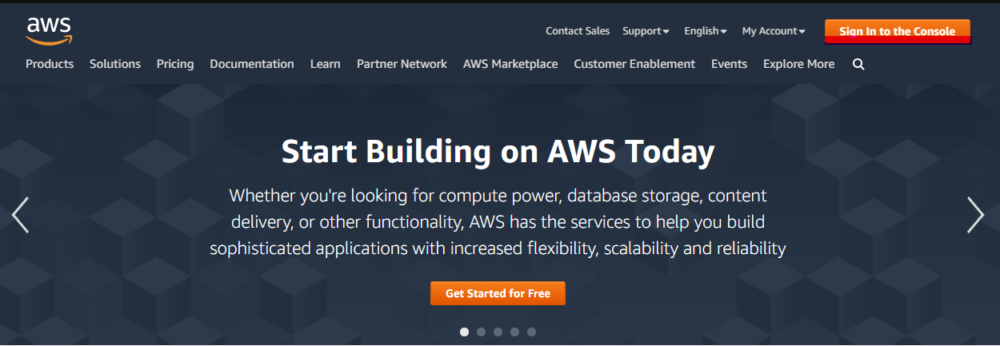

# Click "Create a new AWS account"
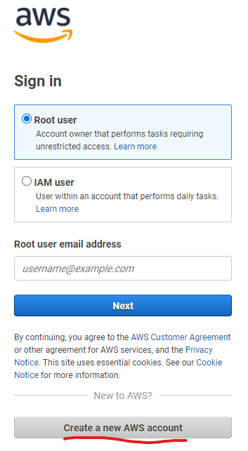

# Fill in Email / password / username
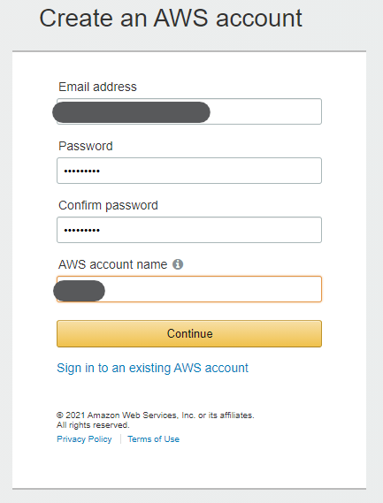

# Select personal account
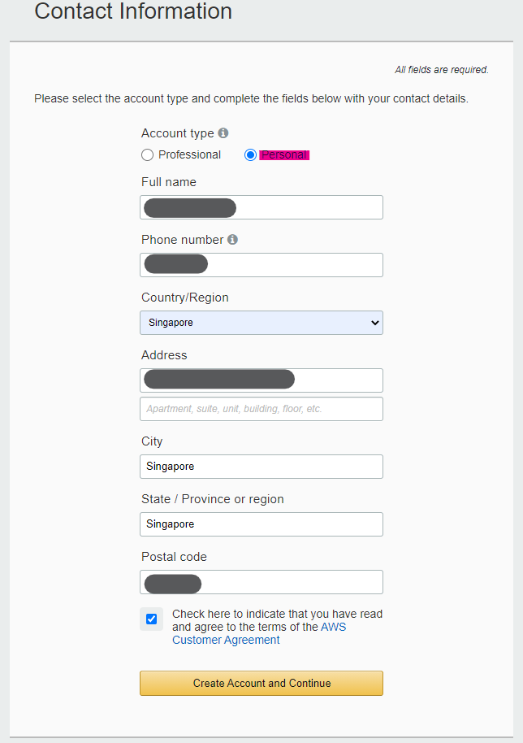

# Add credit card details
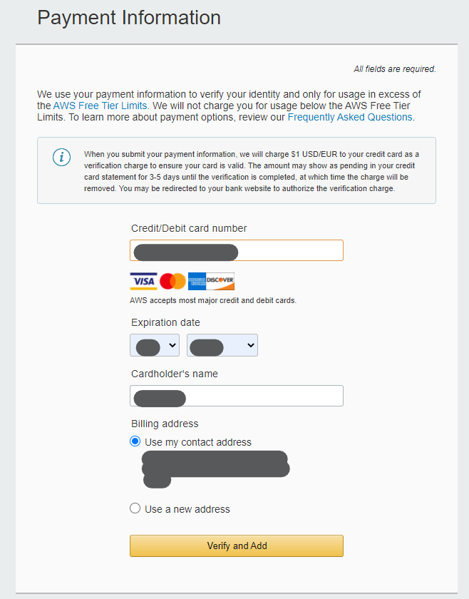

# Setup SMS 2FA authentication
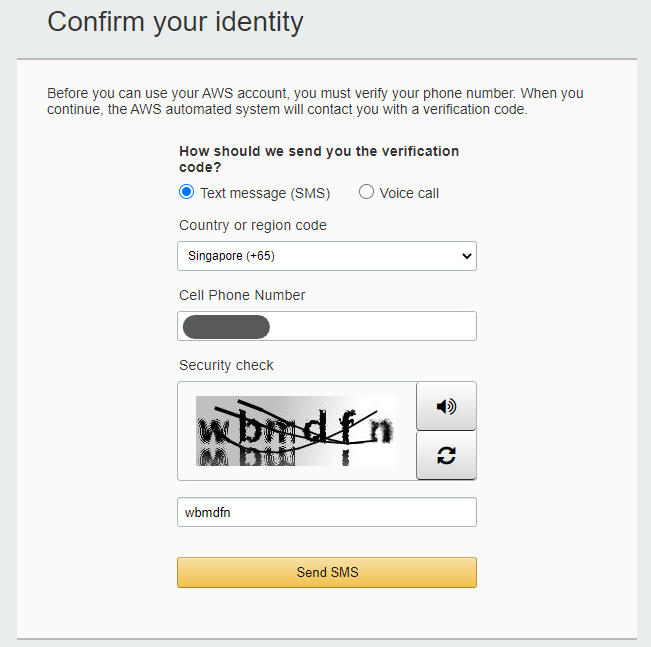

# Select basic plan
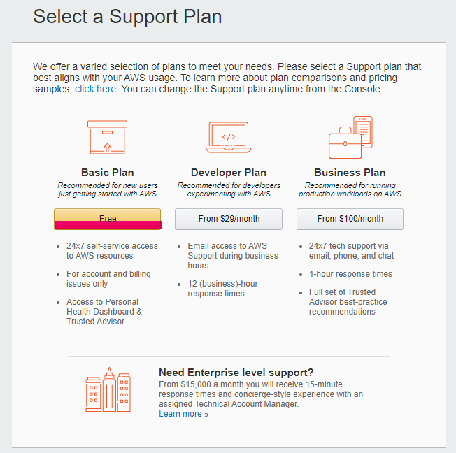

# Sign in to console after account creation
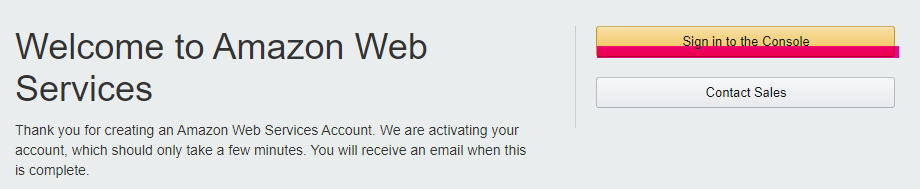

# Sign in as root user
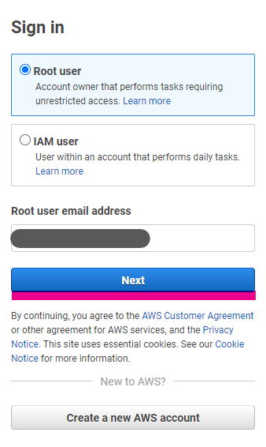

# Select EC2
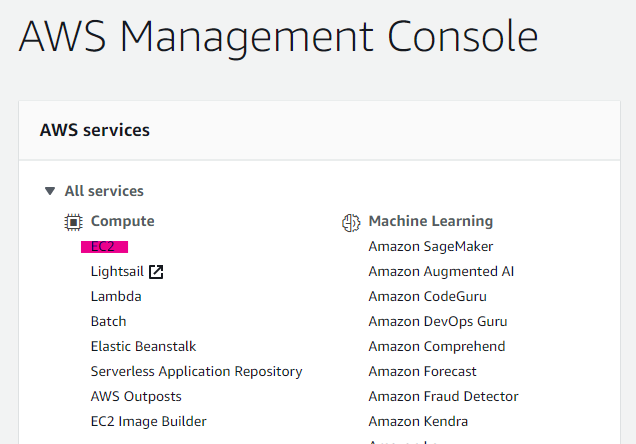

# Select Instances
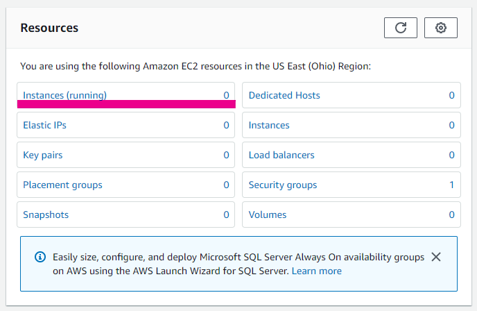

# Select Launch Instances
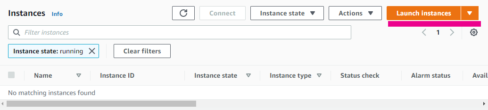

# Select Ubuntu Server 20.04, 64-bit
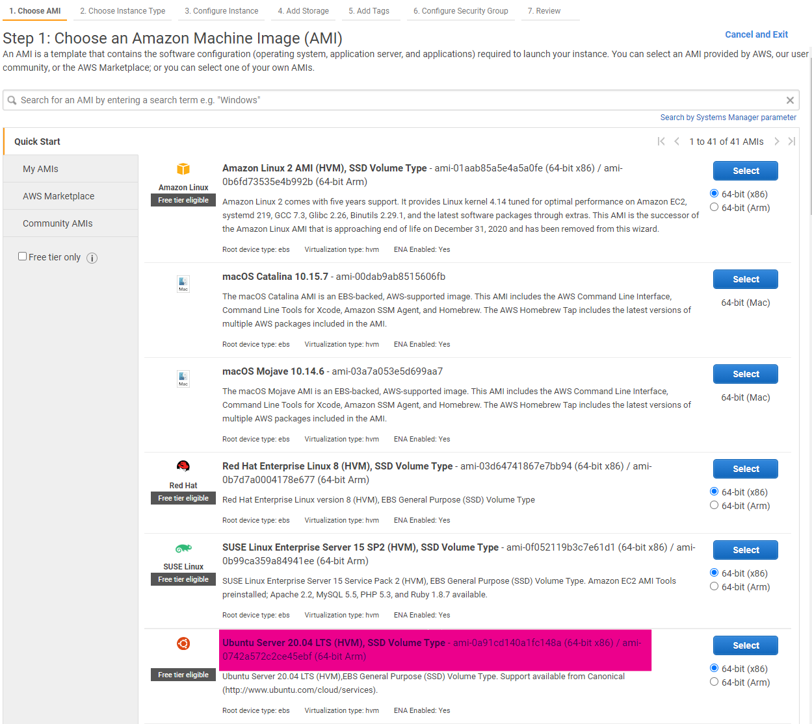

# Select t2.micro
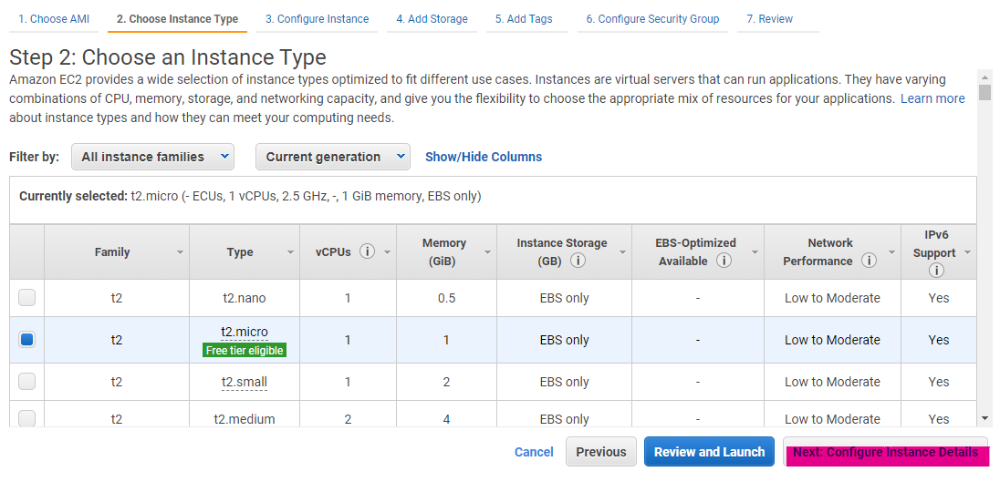

# Select next until security group
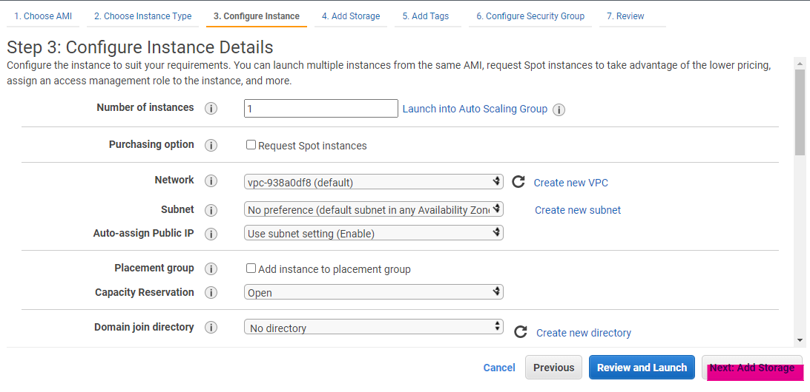 
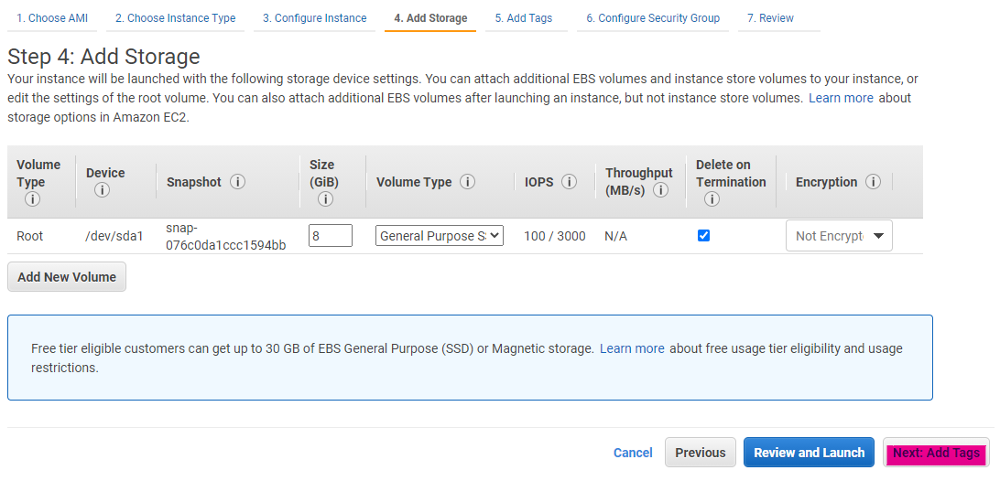 
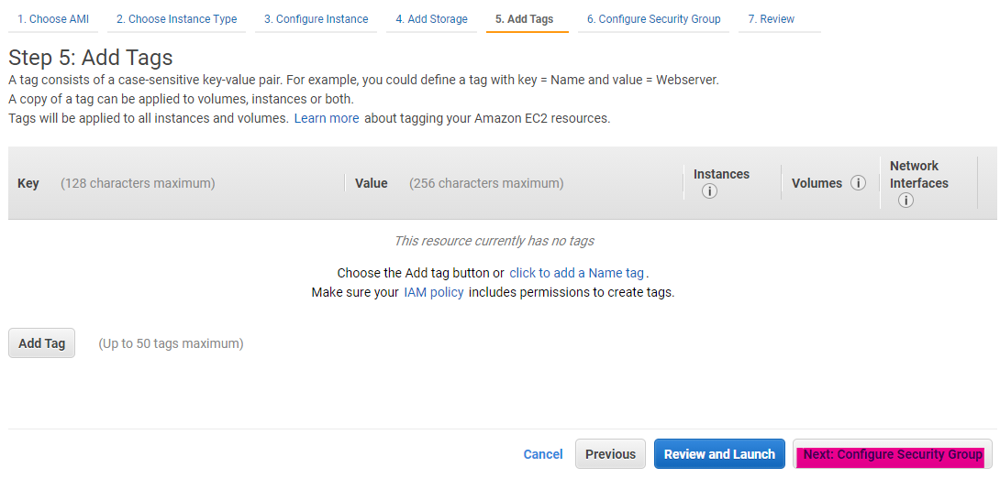 

# Configure Security group
- Add HTTP
- Add HTTPS
- Add Custom TCP with port range 5000
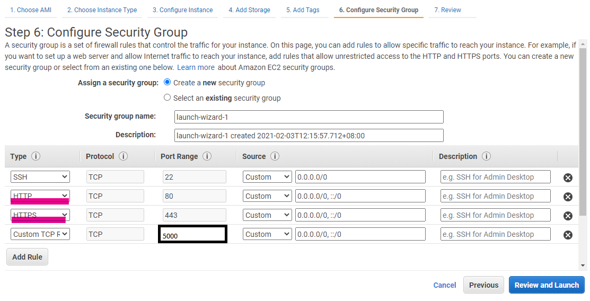 

# Review and Launch
*image detals may not be matching. please ignore discrepencies*
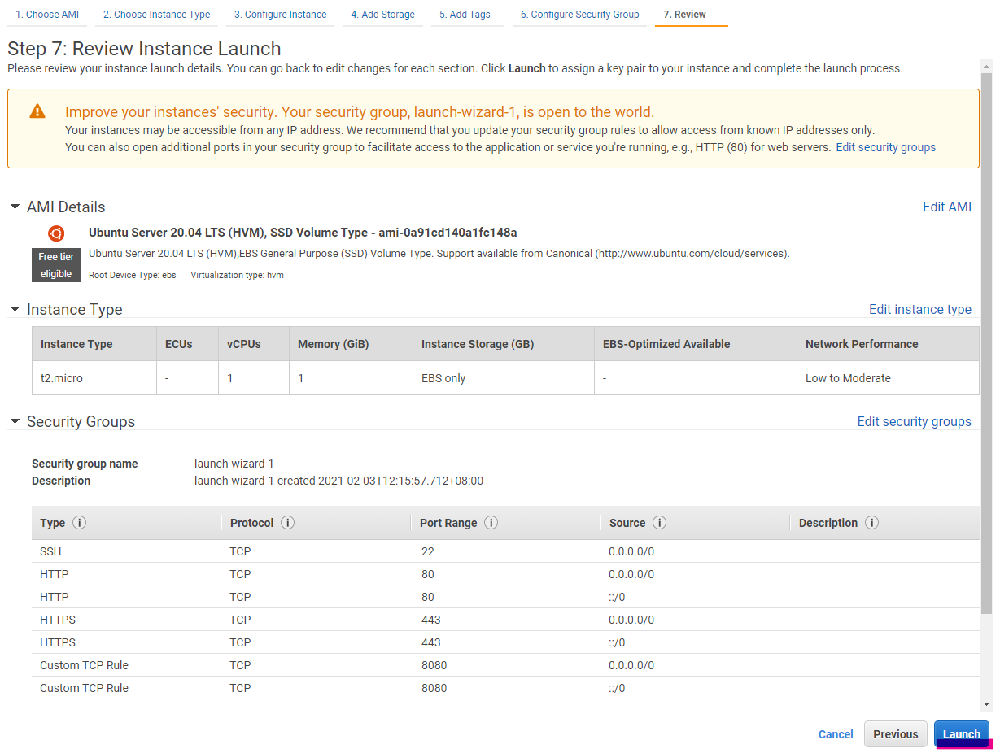

# Create New Key Pair
- Select "Create a new key pair
- give the key a name
- download key pair
- **DO NOT LOSE THIS KEY!**
- Launch instance

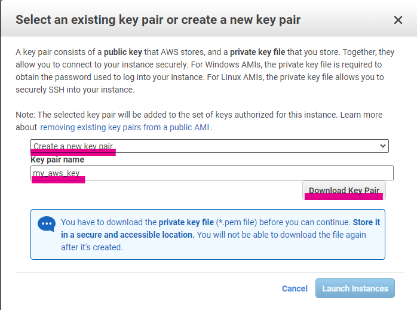

# View Instance
nothing interesting here. next!
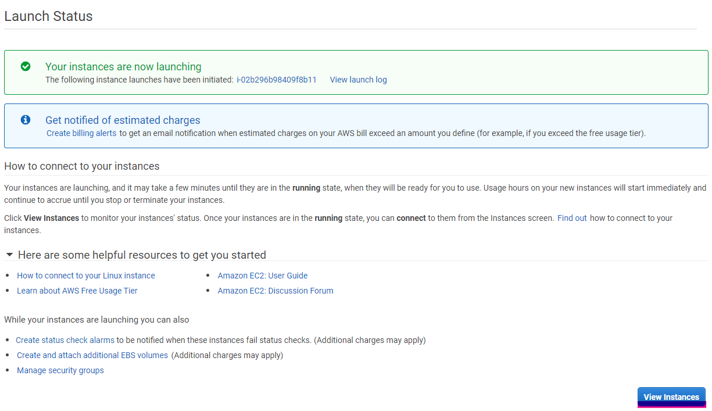

# Select instance
Select the instance after it is running.
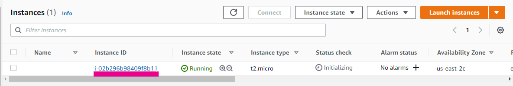

# Select instance
Connect to the terminal 
 
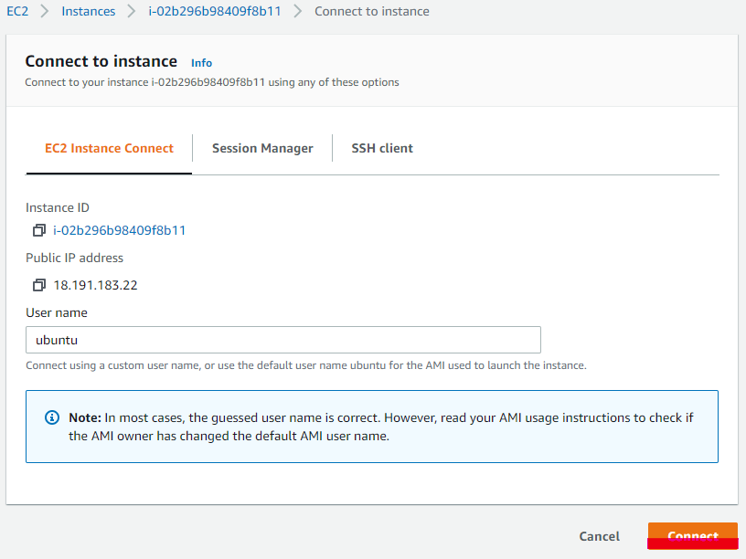

# Check point!
If you see this, you are at the right place

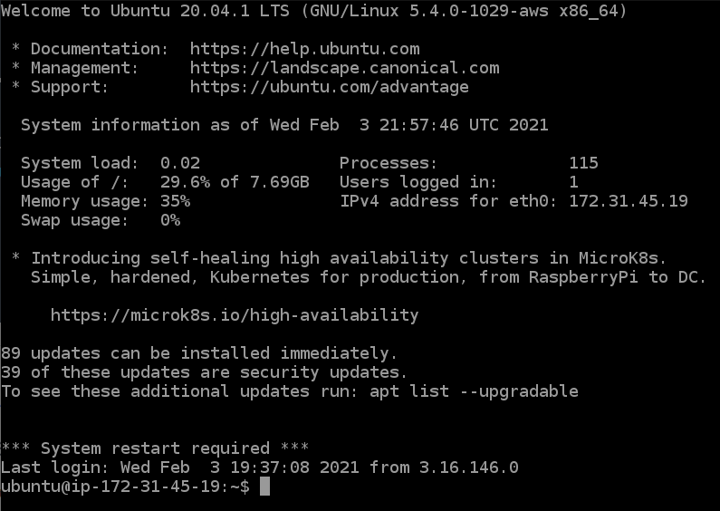